# 深度学习前置学习部分
## 一、Linux基础学习
本次学习使用的是Ubuntu操作系统(目前使用虚拟机来学习linux基本操作，由于wsl与win10系统兼容性，后续等毕设做完后，将电脑升级为win11后，将使用wsl来完成后续的学习和使用)

### Linux指令学习
##### 1、对目录的操作
基本操作
|指令|说明|
|:--:|:--:|
|clear|清除终端|
|pwd|查看路径|
|--help|查看命令的说明|

目录：
|指令|说明|
|:--:|:--:|
|ls|打开目录|
|tree|查看目录|
|||
|cd 目录|切换到指定目录|
|cd ~|切换到主目录|
|cd ..|切换到上一级目录|
|cd .|切换到当前目录|
|cd -|切换到上一次目录|

- cd后不写等价于cd ~
- cd 目录，该目录必须存在
  
##### 2、绝对路径和相对路径
- 与windows一样
  
##### 3、创建和删除文件
|指令|说明|
|:--:|:--:|
|touch 文件名|创建文件|
|mkdir 目录名|创建文件夹|
|rm 文件名或目录名|删除文件或目录|
|rmdir|删除空目录|
- 创建文件无后缀默认txt
- rm AAA -r 强制删除有文件的文件夹

##### 4、复制移动文件
|指令|说明|
|:--:|:--:|
|cp|复制|
|mv|移动|
- cp文件夹需要用 -r
- mv不需要用 -r

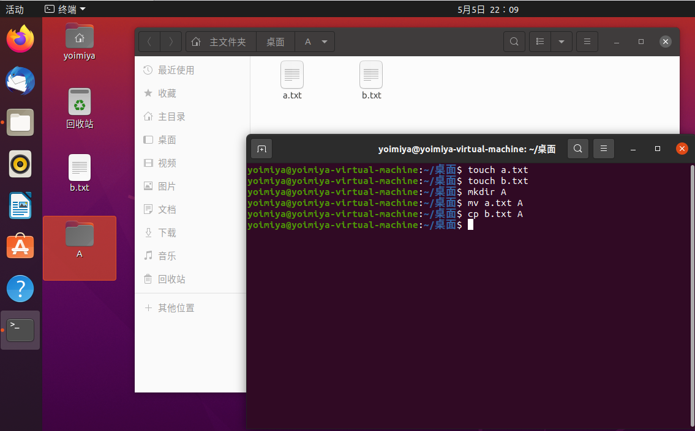

##### 5、终端命令的格式
eg.
|命令|格式|参数|
|:--:|:--:|:--:|
|ls|-r|a.txt|
- 其中选项包括短选项和长选项(eg. -r为短选项，--help为长选项)

##### 6、各种命令选项
###### 6.1 ls
|命令选项|说明|
|:--:|:--:|
|-l|以列表方式显示|
|-h|以大小单位显示，默认是字节|
|-a|显示隐藏文件和目录|


r读w写x执行。前三个表示自己的权限；中间表示同组用户；最后表示其他用户
2表示硬连接次数
Yoimiya表示用户名；yoimiya表示用户组；4096表示大小；修改时间；名字


###### 6.2 mkdir
|命令选项|说明|
|:--:|:--:|
|-p|创建所依赖的文件夹|


###### 6.3 rm
|命令选项|说明|
|:--:|:--:|
|-i|交互式提示|
|-r|递归删除目录及其内容|
|-f|强制删除|
|-d|删除空目录|

###### 6.4 cp
|命令选项|说明|
|:--:|:--:|
|-i|交互式提示|
|-r|递归拷贝目录及其内容|
|-v|显示拷贝后的路径描述|
|-a|保留文件的原有权限（主要针对其他用户）|

注：
- -a也可以拷贝目录，并且拷贝目录时文件权限也不会丢失

###### 6.5 mv
|命令选项|说明|
|:--:|:--:|
|-i|交互式提示|
|-v|显示移动后的路径描述|

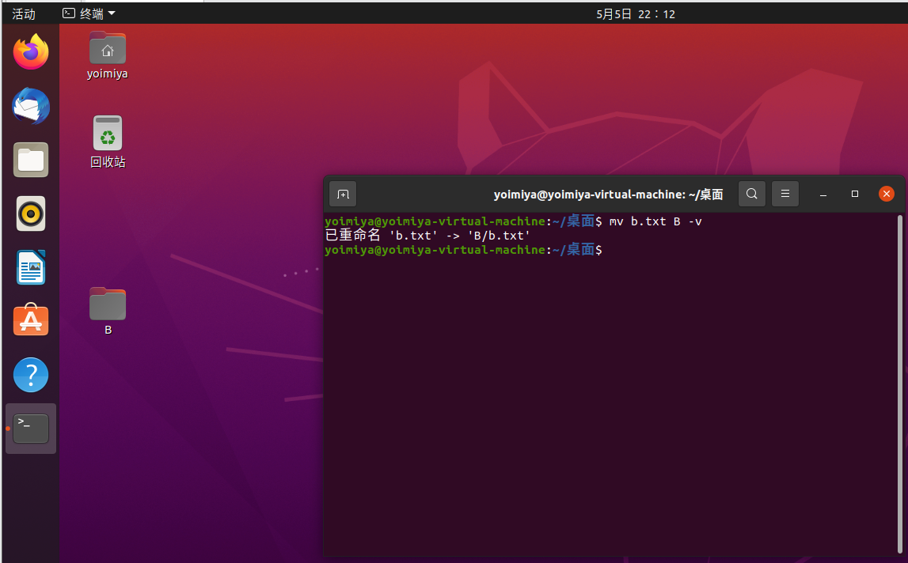

##### 7、重定向命令
重定向：把终端显示的内容保存到文件中
|命令|说明|
|:--:|:--:|
|> 文件名|保存后会覆盖原来的内容|
|>> 文件名|保存后不会覆盖原来的内容|

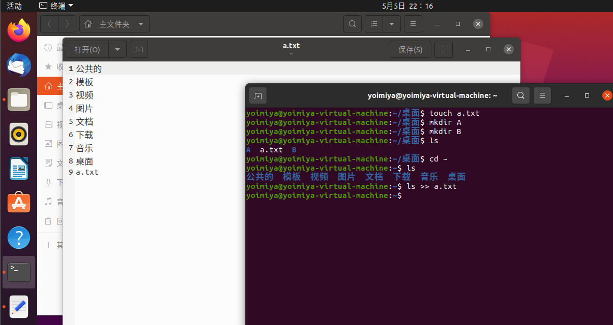

##### 8、查看文件内容
|命令|说明|
|:--:|:--:|
|cat|查看小型文件|
|more|分屏查看大型文件|

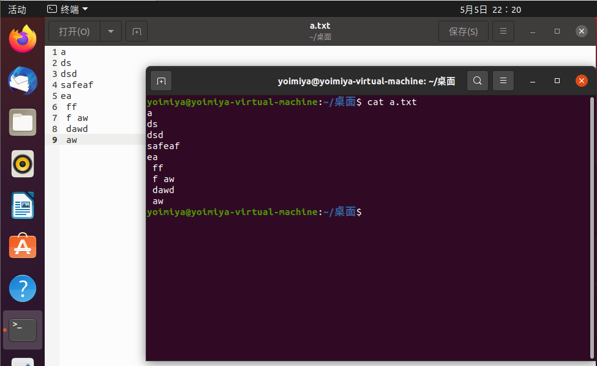

-查看文件有一些快捷键

|快捷键|说明|
|:--:|:--:|
|空格或f|显示下一屏幕的信息|
|回车|显示下一行信息|
|b|显示上一屏幕信息|
|q|退出|

##### 9、软连接、硬连接
软连接即快捷方式
|命令|说明|
|:--:|:--:|
|ln -s|软连接|
|ln|硬连接|
- 创建软连接时，源文件必须使用绝对路径

##### 10、文本搜索
|命令|说明|
|:--:|:--:|
|grep|文本搜索|

一些选项：
|命令|说明|
|:--:|:--:|
|-i|忽略大小写|
|-n|显示行号|
|-v|显示不包含的内容|

grep可以结合正则表达式
|正则表达式|说明|
|:--:|:--:|
|^|以指定字符串开头|
|$|以指定字符串结尾|
|.|匹配一个非换行符的字符|


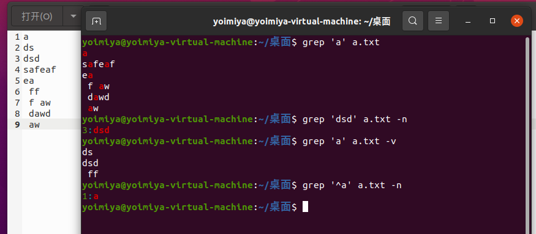

拓展：
- grep可以搜索管道|的内容
- grep搜索可以不使用引号

##### 11、查找文件
|命令|说明|
|:--:|:--:|
|find|查找文件|

|选项|说明|
|:--:|:--:|
|-name|根据名字查找|

find结合通配符使用
|通配符|说明|
|:--:|:--:|
|*|代表0个或多个任意字符|
|?|代表任意一个字符|

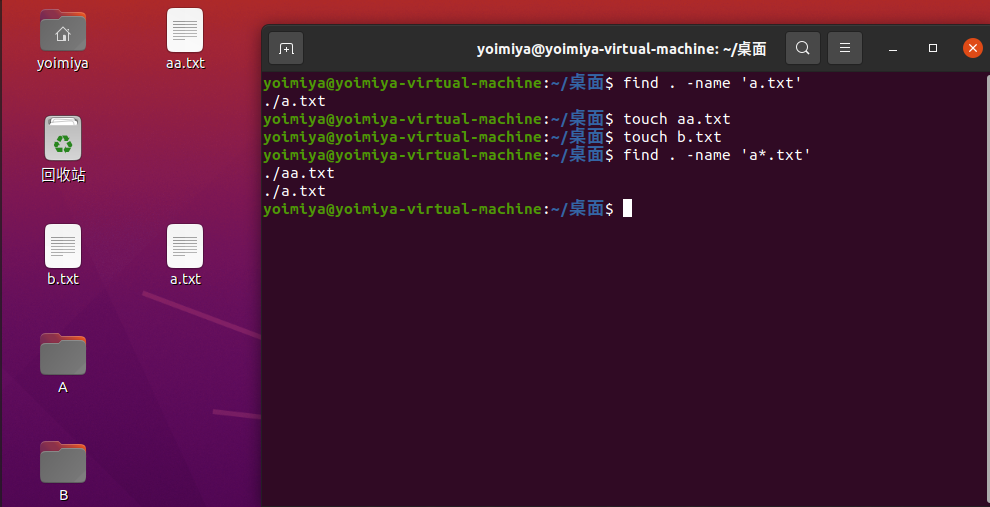

- 通配符也可用于ls、rm、mv等命令中

##### 12、压缩和解压缩
linux默认压缩格式：.gz .bz2 .zip
|命令|说明|
|:--:|:--:|
|tar|压缩和解压缩|

|选项|说明|
|:--:|:--:|
|-c|创建打包文件|
|-v|显示打包或解包的详细信息|
|-f|指定文件名称(必须放在所有选项后面)|
|-z|压缩、解压缩.gz|
|-j|压缩、解压缩.bz2|
|-x|解包|
|-C|解压缩到指定目录|

zip、unzip命令
|命令|说明|
|:--:|:--:|
|zip|压缩为.zip|
|unzip|解压缩.zip|

|unzip选项|说明|
|:--:|:--:|
|-d|解压缩到指定目录|

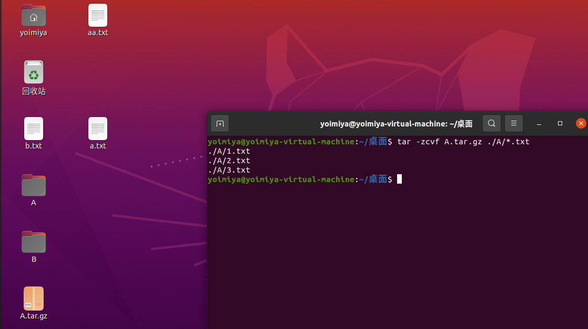

- 尽量使用.gz，占用空间最小
- zip压缩最方便，但文件最大

##### 13、文件权限命令
权限为第6节中所述

|命令|说明|
|:--:|:--:|
|chmod|修改权限|

chmod修改权限有两种方法：字母法和数字法（rwx权限可用数字代替）


|角色|说明|
|:--:|:--:|
|u|user所有者|
|g|group用户组|
|o|other其他用户|
|a|all所有用户|

|操作符|说明|
|:--:|:--:|
|+|增加|
|-|减少|
|=|设置|

权限：
r读(权限值是4)
w写(权限值是2)
x执行(权限值是1)
-无任何权限(权限值是0)

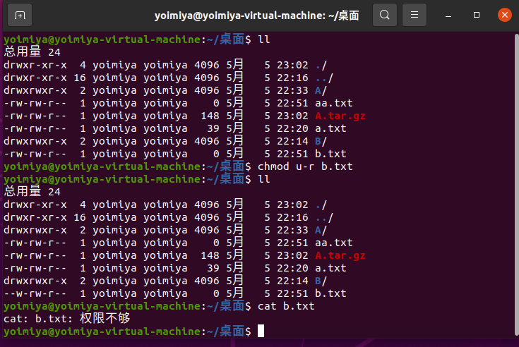

注：.py文件中#的含义
- 注释
- _*_coding:utf-8_*_ 指定编码格式
- #!/python解释器路径 表示选用的解释器

##### 14、获取管理员权限
|命令|说明|
|:--:|:--:|
|sudo -s|切换到root用户|
|sudo|该个命令使用管理员权限|
|exit|退出|
|whoami|查看当前用户|
|who|查看当前所有登录用户|
|which|查看命令位置|
|shutdown -h now|立即关机|
|reboot|重启|
|passwd|设置密码|

- root用户使用时要小心

##### 15、用户相关操作
创建用户要管理员权限
|命令|说明|
|:--:|:--:|
|useradd|创建用户|
|su - 用户名|切换用户|
|sudo passwd 用户名|改密码|
|id|查看用户信息|
|usermod|修改用户信息|
|gpasswd|删除附加组信息|
|userdel|删除用户|

|useradd选项|说明|
|:--:|:--:|
|-m|自动创建用户主目录，主目录的名字即为用户名|
|-g|指定用户组，不指定默认创建一个同名的用户组|

- 只有把新用户添加到sudo附加组中才能使用sudo(需要在主用户中使用)

|usermod选项|说明|
|:--:|:--:|
|-G|设置附加组|
|-g|修改用户组|


|gpasswd选项|说明|
|:--:|:--:|
|-a 用户名|添加附加组|
|-d 用户名|删除附加组|

|userdel选项|说明|
|:--:|:--:|
|-r 用户名|删除用户主目录，必须添加，否则删不了主目录|

##### 16、用户组相关操作
用户组需要使用管理员权限

|命令|说明|
|:--:|:--:|
|groupadd|创建用户组|
|groupdel|删除|
- 删除时用户组里面不能有用户


##### 17、远程登录、远程拷贝
|命令|说明|
|:--:|:--:|
|ssh|远程登录|
|scp|远程拷贝|
- 需要安装ssh客户端软件和ssh服务端软件

安装：
```
sudo apt-get install openssh-server
sudo apt-get install openssh-client
```
查看所有软件
```
apt list
```
可以通过管道来查看是否安装某软件
```
apt list | grep opensh-server
```

客户端查看软件, cmd输入以下命令
```
ssh -V
```
###### 17.1、远程登录
使用windows连接linux


在linux中查看

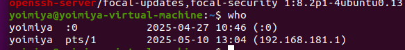

连接成功

###### 17.2、远程拷贝
通过scp将客户端文件拷贝到服务器：

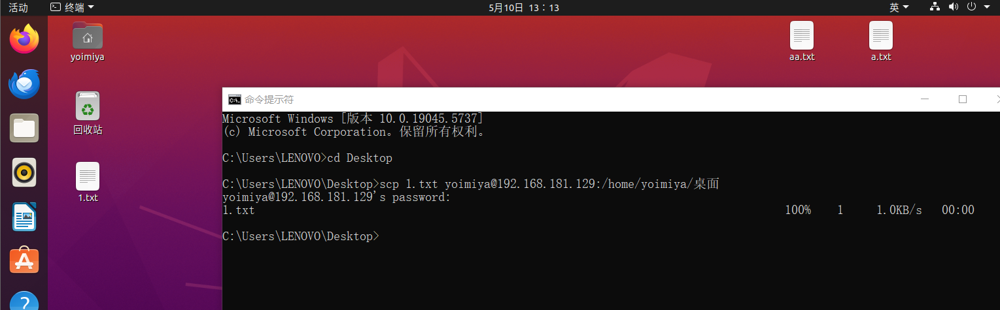

- 另外可使用FileZilla软件来进行拷贝

##### 18、Vim
编辑器Vim：可以使用命令来编辑，完全脱离鼠标

Vim工作模式：命令模式、编辑模式、末行模式

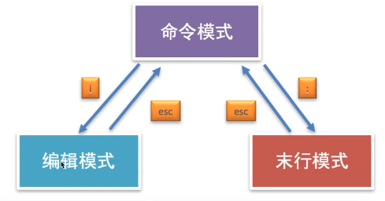

```
w 保存
wq 保存退出
x 保存退出
q! 强制退出不保存
```

##### 19、软件安装

###### 19.1、depk安装(deb文件安装，可离线)
|depk选项|说明|
|:--:|:--:|
|-i|离线安装|

```
sudo depk -i 安装包
```
- 卸载、安装程序都要管理员权限

###### 19.2、apt-get安装（需联网）
```
sudo apt-get install 安装包
```
- 默认从国外下载
需修改镜像源（可在软件和更新中修改）
修改完后要使用sudo apt-get update更新

##### 20、软件卸载
```
sudo dpkg -r 安装包
sudo apt-get remove 安装包
```


## 二、Conda、CUDA、CuDNN环境搭建
##### 1、下载anaconda
官网地址
```
https://www.anaconda.com/download
```
正常下载安装，之后可以在anaconda prompt中安装多个不同的conda环境以及python的各种库

##### 2、CUDA和cuDNN安装

###### 2.1首先需要NVIDIA显卡，在cmd中输入
```
nvidia-smi
```
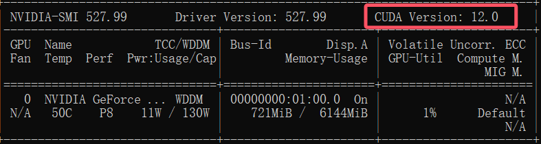

CUDA Version为CUDA支持的最高版本

###### 2.2下载CUDA
```
https://developer.nvidia.com/cuda-toolkit-archive
```
我下载的为11.6.2版本的CUDA：

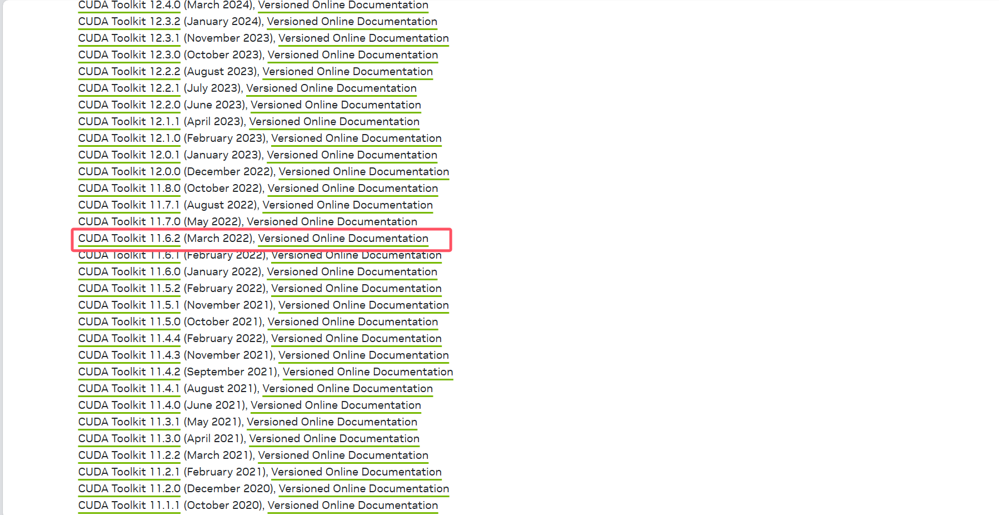

正常下载安装后在cmd中输入
```
nvcc -V
```
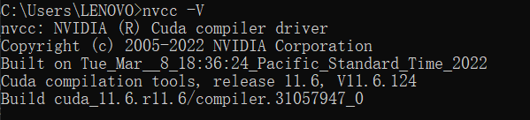

当看到上图所示即为安装成功

###### 2.3安装cuDNN
打开网址
```
https://developer.nvidia.com/rdp/cudnn-archive
```
注意网站中的for CUDA xx.x，根据此来安装对应的cuDNN
我安装的是：


下载解压后得到

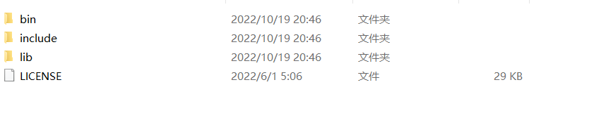

将这三个文件放到CUDA的文件夹中后安装成功


##### 3、安装CUDA对应版本的pytorch

```
https://pytorch.org/get-started/previous-versions/
```
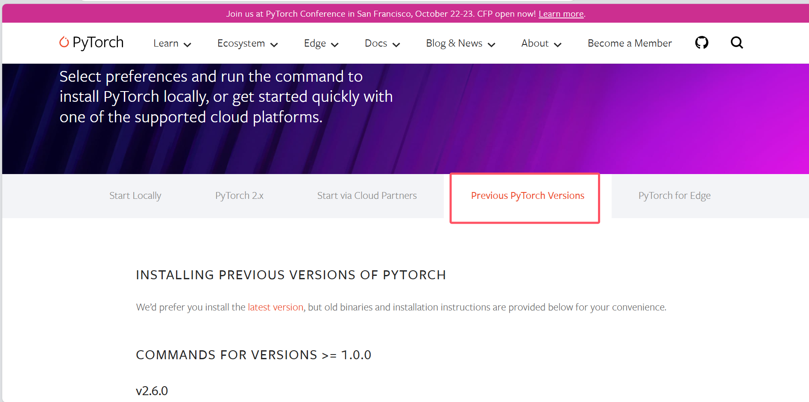

在此处找到pytorch对应的CUDA
    
我使用的是1.12.0的torch,对应的CUDA版本为1.16，因此可以在官网找到指令
```
pip install torch==1.12.0+cu116 torchvision==0.13.0+cu116 torchaudio==0.12.0 --extra-index-url https://download.pytorch.org/whl/cu116
```
打开anaconda prompt，在对应的conda环境中输入该指令，即开始安装CUDA版本的pytorch

安装成功后可看到

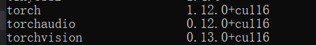

安装成功


## 三、计算机网络

##### 1、硬件连接
将网线两段插入两台电脑

##### 2、配置网络接口
设置两个服务器的IP地址，确保在同一个子网内
```
# 假设网卡名称为 eth0
# 服务器 A 配置：
sudo ip addr add 192.168.1.1/24 dev eth0
sudo ip link set eth0 up

# 服务器 B 配置：
sudo ip addr add 192.168.1.2/24 dev eth0
sudo ip link set eth0 up
```

##### 3、测试连通性
在任意服务器上执行ping命令：
```
# 在服务器 A 上执行：
ping 192.168.1.2

# 在服务器 B 上执行：
ping 192.168.1.1
```

##### 4、数据传输
1、使用SCP或SFTP传输
```
# 从服务器 A 传输文件到服务器 B（需 SSH 服务已启动）
scp /path/to/local/file username@192.168.1.2:/path/to/remote/directory
```

2、使用rsync传输
```
rsync -avz /path/to/local/dir/ username@192.168.1.2:/path/to/remote/dir/
```
3、使用NFS传输
```
# 服务器 A 作为 NFS 服务端：
sudo apt install nfs-kernel-server
sudo echo "/data 192.168.1.2(rw,sync,no_subtree_check)" >> /etc/exports
sudo systemctl restart nfs-server

# 服务器 B 挂载目录：
sudo mount -t nfs 192.168.1.1:/data /mnt/nfs
```


## 四、科学上网
##### 1、下载clashverge
```
www.clashverge.dev
```

##### 2、订阅
略

##### 3、应用于linux
在www.clashverge.dev中下载的clashverge在安装时会出现 "clash-verge : 依赖: libwebkit2gtk-4.1-0 但无法安装它" 的问题，因此换了另一个版本的clashverge
```
https://github.com/KalosAner/KalosAner.github.io/blob/master/resource/software/clash-verge_1.7.6_amd64.deb
```
安装好后配置好文件成功打开youtube说明安装成功


